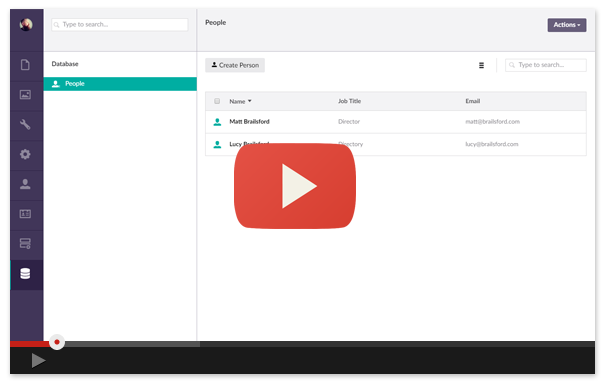

# Fluidity

Fluidity is a rapid Umbraco user interface builder for custom data structures configured via a fluent API. 

If you have a custom data store that you’d like to be able to content manage from within Umbraco then Fluidity will allow you quickly configure a custom management user interface, reusing many core components and with a consistent look and feel, in just a few lines of code. 

With Fluidity, custom data user interfaces can now take a matter of minutes, rather than days.

## Documentation 

For detailed documentation, please visit: [https://umco.github.io/umbraco-fluidity/](https://umco.github.io/umbraco-fluidity/)

## Contributing to this project

Anyone and everyone is welcome to contribute. Please take a moment to review the [guidelines for contributing](CONTRIBUTING.md).

* [Bug reports](CONTRIBUTING.md#bugs)
* [Feature requests](CONTRIBUTING.md#features)
* [Pull requests](CONTRIBUTING.md#pull-requests)

## The Team

* [Matt Brailsford](https://github.com/mattbrailsford)
* [Lee Kelleher](https://github.com/leekelleher)

### Special thanks

* Fluidity is inspired by my learnings from contributing to the [UI-O-Matic](https://github.com/TimGeyssens/UIOMatic) package by [Tim Geyssens](https://github.com/TimGeyssens) so a special thanks goes to Tim for the inspiration.

## License

Copyright © 2017-2019 Matt Brailsford and contributors

Licensed under the [Apache 2.0 License](LICENSE.md)
